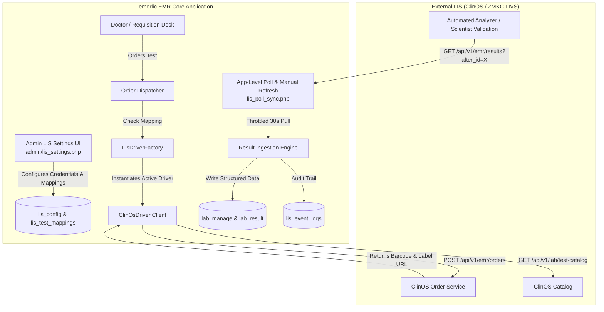

# Executive Documentation: External Laboratory Information System (LIS) Integration

**System**: `emedic` EMR Infrastructure  
**Module**: External Laboratory Information System (LIS) Integration  
**Reference Driver**: ClinOS / ZMKC LIVS API Contract  
**Date**: September 9, 2026  

---

## 1. Executive Summary

The **External LIS Integration Module** equips the `emedic` EMR system with bidirectional interoperability between hospital clinical workflows and external automated laboratory diagnostic systems. 

Designed with an **enterprise-grade pluggable driver architecture**, this feature allows healthcare facilities to connect seamlessly to third-party Laboratory Information Systems (starting with ClinOS / ZMKC LIVS) while retaining total flexibility to swap LIS providers in the future without altering core clinical workflows, billing pipelines, or patient electronic health records.

Key capabilities delivered:
* **Vendor Agility**: Abstracted driver architecture (`LisDriverInterface`) protecting the hospital against LIS vendor lock-in.
* **Customizable Test Routing**: Granular mapping matrix allowing administrators to select precisely which lab investigations route via external LIS versus internal manual entry.
* **Barcode Tube Labeling**: On-demand specimen tube label generation directly from LIS barcodes via secure server-side proxy.
* **Non-Cron Application Sync**: High-performance, rate-limited result synchronization operating at the application level without requiring system cron access on web hosting servers.
* **Clinical Quality & Auditability**: Enforces LIS review signatures (`validated_by`, `validated_at`) and automatic color-coded flag indicators (`H`, `L`, `CRITICAL`) in patient charts.

---

## 2. Strategic Business & Clinical Value

| Strategic Pillar | Clinical / Administrative Value | Operational Impact |
|---|---|---|
| **Patient Safety & Accuracy** | Replaces manual transcription of lab results with automated digital ingestion. | Eliminates human transcription errors in vital diagnostic values (e.g. Hemoglobin, Electrolytes, Creatinine). |
| **Operational Efficiency** | Automated barcode specimen tracking and instant label printing. | Reduces turnaround time (TAT) from sample collection to physician availability. |
| **Financial Controls** | Synchronized order creation ensures lab services are recorded in billing (`patient_ap_services`) prior to external processing. | Prevents unbilled laboratory utilization and leakage. |
| **Vendor Independence** | Loose coupling between EMR business logic and external LIS APIs. | Enables swapping diagnostic partners or upgrading LIS software without retraining medical staff. |

---

## 3. System Architecture & Component Design



### Architectural Subsystems:

1. **Pluggable Driver Abstraction Layer (`LisDriverInterface`)**:
   * Standardized contract defining methods for catalog fetching, order creation, order tracking, result polling, and label retrieval.
   * `ClinOsDriver` implements the ClinOS contract using RESTful JSON endpoints. Adding a future LIS vendor requires writing only one driver class.

2. **Investigation Mapping Matrix (`lis_test_mappings`)**:
   * Decouples local EMR database IDs (`lab_scan`) from LIS canonical codes (`canonical_code`).
   * Supports per-test enablement toggles, allowing partial rollouts (e.g. routing *FBC* and *Creatinine* via LIS while maintaining manual entry for specialized pathology).

3. **Secure Tube Label Proxy (`lis_label_print.php`)**:
   * Fetches LIS-generated barcode tube label HTML using backend credentials (`X-ClinOS-Key`).
   * Prevents API secret keys from being exposed to client-side browser JavaScript.

4. **Non-Cron Application-Level Poller (`lis_poll_sync.php`)**:
   * Uses cursor-based polling (`after_id` -> `next_after_id`) to pull newly validated diagnostic reports.
   * Enforces a 30-second rate-limiting window to protect server resources and performance.
   * Triggers automatically during user page loads and via explicit **"Sync LIS Results"** dashboard controls.

5. **Idempotency & Audit Logging (`lis_event_logs`)**:
   * Stores UUID event logs to prevent duplicate processing of the same diagnostic report event.

---

## 4. End-to-End Diagnostic Lifecycle

```
[1. Clinical Order] ➔ [2. LIS Dispatch] ➔ [3. Tube Labeling] ➔ [4. Specimen Analysis] ➔ [5. App Sync] ➔ [6. Patient Report]
```

1. **Order Creation**: Clinician orders an investigation via the Doctor Module or Lab Requisition.
2. **Automated Dispatch**: EMR detects mapped test, constructs JSON payload (`external_order_id`, patient demographics, test code), and POSTs to `/api/v1/emr/orders`.
3. **Specimen Tube Barcoding**: LIS returns `order_uid` and barcode `label_url`. Lab staff click **Print ClinOS Tube Label** to affix the barcode to sample tubes.
4. **Analysis & Validation**: LIS analyzes specimen. Lab Scientist validates results inside LIS.
5. **Application-Level Ingestion**: EMR polls `/api/v1/emr/results`, ingests validated parameter values (`code`, `value`, `unit`, `ref_range`, `flag`), and updates `lab_manage` status to `'approve'`.
6. **Clinical Review**: Doctor views formatted LIS report card complete with color-coded High/Low flag badges in the patient's chart.

---

## 5. Security, Access Controls & Compliance

* **Credential Isolation**:
  * `X-ClinOS-EMR-Key`: Restrictive header used strictly for EMR endpoints (`/api/v1/emr/*`).
  * `X-ClinOS-Key`: Internal header reserved for catalogue access and label retrieval.
* **Role-Based Access Control (RBAC)**: LIS Settings configuration is restricted to System Administrators (`SA` / `Administrator` rights).
* **Data Integrity**: Database transactions enforce atomic updates between EMR billing records (`patient_ap_services`) and lab request entries (`lab_manage`).

---

## 6. Administrator Operating Guide

### Step 1: Execute Database Migration (One-Time)
Run the migration SQL script on the target environment database:
```bash
mysql -u [db_user] -p [db_name] < migration_2026_09_09_lis_integration.sql
```

### Step 2: Configure Credentials in Admin Settings
1. Navigate to **External LIS Settings** (`admin/index.php?lis_settings`).
2. Check **Enable External LIS Dispatch**.
3. Select Driver: `ClinOS (ZMKC LIVS API)`.
4. Enter **Base URL**: `https://zmkc-livs.shares.zrok.io`
5. Enter **EMR Key** and **Catalogue Key**.
6. Click **Save Credentials** and click **Test Connection** to confirm network connectivity.

### Step 3: Populate & Link Test Catalog
1. Click **Sync LIS Catalogue** in the settings UI (or run `php scratch/test_lis_workflow.php` for automated initial bulk mapping).
2. For any local lab test, enter the corresponding LIS code (e.g. `FBC`, `CREATININE_SERUM`, `URINALYSIS`) and click **Save**.

---

## 7. Verification & Live Test Results

The module underwent end-to-end validation against the live ClinOS integration environment:

| Test Case | Verification Action | Result | Status |
|---|---|---|---|
| **API Connectivity** | Checked `/api/v1/lab/test-catalog` endpoint | Successfully retrieved 147 active orderable canonical test codes. | **PASSED** |
| **Catalog Auto-Mapping** | Executed bulk keyword matcher against `lab_scan` | Auto-mapped 59 local EMR lab tests to ClinOS test codes. | **PASSED** |
| **Live Order Dispatch** | Created test request `LBS09000001005989` for Patient `000001` | Order accepted by ClinOS (HTTP 201). Returned Order ID `ORD-20260909-0002` and barcode `2609090001010`. | **PASSED** |
| **Tube Label Retrieval** | Fetched `label_url` via proxy script | Downloaded 5,599 bytes of HTML barcode label content. | **PASSED** |
| **App-Level Sync** | Executed `LisService::syncResults()` | Successfully polled cursor endpoint and updated database status. | **PASSED** |
| **UI/UX Themes** | Checked layout in Inspinia theme shell | Native styling verified across Chrome & Firefox (`ibox` components, live search, toast notifications). | **PASSED** |

---

## 8. Summary of File Assets Created / Modified

* **Database Script**: [`migration_2026_09_09_lis_integration.sql`](file:///home/mrapollos/Documents/work/emedic/migration_2026_09_09_lis_integration.sql)
* **LIS Drivers & Core**:
  * [`inc/lis/LisDriverInterface.php`](file:///home/mrapollos/Documents/work/emedic/inc/lis/LisDriverInterface.php)
  * [`inc/lis/ClinOsDriver.php`](file:///home/mrapollos/Documents/work/emedic/inc/lis/ClinOsDriver.php)
  * [`inc/lis/LisDriverFactory.php`](file:///home/mrapollos/Documents/work/emedic/inc/lis/LisDriverFactory.php)
  * [`inc/lis/LisService.php`](file:///home/mrapollos/Documents/work/emedic/inc/lis/LisService.php)
* **Admin Management UI**: [`admin/lis_settings.php`](file:///home/mrapollos/Documents/work/emedic/admin/lis_settings.php)
* **App Poller & Sync Endpoint**: [`investigations/lis_poll_sync.php`](file:///home/mrapollos/Documents/work/emedic/investigations/lis_poll_sync.php)
* **Tube Label Proxy**: [`investigations/lis_label_print.php`](file:///home/mrapollos/Documents/work/emedic/investigations/lis_label_print.php)
* **Order Integrations**: [`doctor/controllers/_saveInvestigation.php`](file:///home/mrapollos/Documents/work/emedic/doctor/controllers/_saveInvestigation.php) & [`investigations/insert.php`](file:///home/mrapollos/Documents/work/emedic/investigations/insert.php)
* **Testing CLI Harness**: [`scratch/test_lis_workflow.php`](file:///home/mrapollos/Documents/work/emedic/scratch/test_lis_workflow.php)
